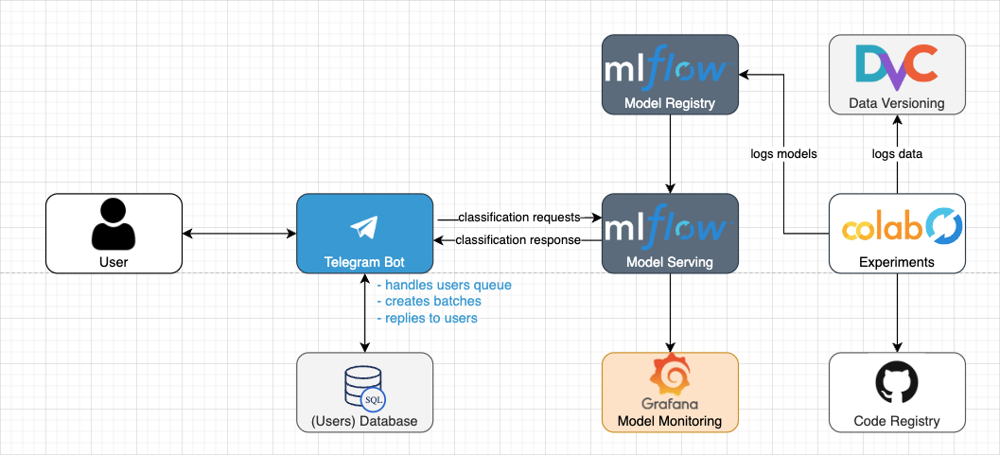

# ml-design-doc

ML system design doc for NeuroSpeech.

---
## 1. Overview

This document outlines the design of NeuroSpeech, a Telegram bot that aims to facilitate early detection of neurodegenerative diseases like Alzheimer's. The bot enables users to upload voice samples and receive feedback regarding the possibility of disease development.

Target audience of the bot are people who take care of the eldderly or another risk group.

## 2. Motivation
Neurodegenerative disorders represent a growing healthcare challenge that demands innovative solutions. From [1990 to 2019](https://www.frontiersin.org/articles/10.3389/fpubh.2022.952161/full), the global burden of neurological disorders has shown a concerning upward trend, with a particular rise in **non-communicable neurological disorders**. These disorders, which include conditions such as Alzheimer's disease, Parkinson's disease, and amyotrophic lateral sclerosis (ALS), not only affect the quality of life for millions but also place an increasing strain on healthcare systems worldwide.

Over the past dozen years, the absolute number of people disturbed by Parkinson's disease and dementia has more than doubled worldwide. **An estimated 6.7 million Americans age 65 and older are living with Alzheimer's in 2023, and nearly 1 million is living with Parkinson's disease**. 

Our project aims to use the power of speech recognition AI algorithm**s to detect and classify** neurodegenerative disorders. By using the capabilities of artificial intelligence, we aspire to provide a valuable tool that can help in early diagnosis, monitoring, and, ultimately, better management of these conditions.

## 3. Success metrics
The ideal success metrics would be a percent of correct detections or, even better, the number of people who dot early treatment due to the use of the app. However, it's almost impossible to measure that.

Instead, we will measure users' satisfaction or NPS. To do that we will have customer surveys in the bot. The goal is to get 8+ average NPS.

Also, we will measure up-time and average response time of the service. The goal is to have 90% up-time and average response time under 24 hours.

We are not focusing on DAU as the bot is not intended for frequent use.

## 4. Requirements & Constraints

### Functional Requirements

1. User registers in the Telegram app using the bot
2. User signs user agreements, accepts disclaimers
3. User can get links to articles about neuro-degenerative deseases
4. User requests to get assesment for signs of desease (1 request per day)
5. User gets an image that needs to be described using voice
6. User sends voice messege with image description (min 1 minute)
7. User get prompted for age, gender, language
8. User gets analysis results in a way of likelihood of neuro-degenerative desease (need to calibrate the model)

### Non-functional Requirements

- batch scoring
- the system should handle throughput of 500 users per day, peak 100 u/h
- latency for bot responce should be under 2 minutes
- latency for assesment results should be under 24 hours
- the system should stay responsive under load / when parts of the system fail. It should give impression of working (see Graceful Degradation)
- the system should filter out requests from underaged
- the system should assess the quality of a voice sample (pre-classification of input)
- accuracy. The underlying ML model should be precise (90+%). Focus on precision over recall
- legal. The system should provide all legal disclaimerss 
- ethics.
- security. The system should not store PII
- costs. Infra cost should be under $$/month

### 4.1 What's in-scope & out-of-scope?
#### In Scope
- Telegram bot
- Classification service
- voice sample analysis
- batch scoring
- data security/privacy
- etics?

#### Out of Scope
- mobile app
- on-device scoring
- realtime scoring
- retraining on user data
- collecting user data
- treatment recommendations / matching with doctors
- hardware, language translation
- other languages…

## 5. Methodology

### 5.1. Problem statement

The problem is a supervised task - classification. We will train on examples of healthy persons and persons with different stages of the desease.

### 5.2. Data

**Training**
- .mp3 samples of healthy person speaking
- .mp3 files of Alzheimer's patient speaking
- .mp3 files of Parkinson's patient speaking
- age and gender information

Datasets from open sources. The datassets are balanced.

**Need to check if the samples match data from Telegram bot.**

**Inference**
- voice sample from Telegram message
- age, gender and language

### 5.3. Techniques

#### Features
- audio2vec
- text (Whisper) and linguistic features
- age and gender

#### Algorithms
- CNN, LSTM, BiLSTM
- Transformer models (BERT?), acoustic and linguistic embedding
- NLP: speech-to-text conversion and then text-based analysis

### 5.4. Experimentation & Validation

- Partition data into training, validation and test dataset
- evaluate the model using metrics such as precision, recall, f1-score, roc-auc, specificity
- false positive tests on healthy subjects (mobile device recordings)

> What is the priority: precision or recall?
>
> How do we handle an imbalance in the dataset?

### 5.5. Human-in-the-loop

Periodic monitoring and retraining of the model.

## 6. Implementation

### 6.1. High-level design

### 6.2. Infra

Cloud...

### 6.3. Performance (Throughput, Latency)

How will your system meet the throughput and latency requirements? Will it scale vertically or horizontally?

### 6.4. Security

- Telegram auth
- public availability
- usage caps

### 6.5. Data privacy

- not storing user data

### 6.6. Monitoring & Alarms

- response time
- up-time

### 6.7. Cost
How much will it cost to build and operate your system? Share estimated monthly costs (e.g., EC2 instances, Lambda, etc.)

### 6.8. Integration points

How will your system integrate with upstream data and downstream users?

### 6.9. Risks & Uncertainties

Risks are the known unknowns; uncertainties are the unknown unknows. What worries you and you would like others to review?

## 7. Appendix

### 7.1. Alternatives

What alternatives did you consider and exclude? List pros and cons of each alternative and the rationale for your decision.

### 7.2. Experiment Results

Share any results of offline experiments that you conducted.

### 7.3. Performance benchmarks

Share any performance benchmarks you ran (e.g., throughput vs. latency vs. instance size/count).

### 7.4. Milestones & Timeline

- **Month 1**: Discovery Work
- **Month 2 and Beyond**: Productization

### 7.5. Glossary

Define and link to business or technical terms.

### 7.6. References

Add references that you might have consulted for your methodology.
